# Nasdaq 板块萌芽现象统计检验

## 预注册判据结论

- 板块定义：Nasdaq screener 细分行业（非 GICS）
- 数据文件：2952；映射到研究板块的代码：2795
- 偏差声明：基于当前股票池与静态行业快照回填历史，存在幸存者偏差和行业归属漂移；结论偏乐观，真实表现只会更差。
- 合成对照闸门：全部通过。
  - 正对照：通过；{'mean_ic': 0.10405543196143864, 'top_bottom': 0.276297756778555, 'hac_t': 8.979171605108203}
  - 负对照：通过；{'mean_ic': -0.00010134872080088974, 'false_positive_rate': 0.05, 'repetitions': 200}
  - 置换检验：通过；{'mean_ic': -0.0009603262884686677, 'p_value': 0.9123775236188336}
  - 手算单测：通过；{'first_day_ic': 1.0, 'hac_t': 4.242640687119285}

### Horizon 20
- IC 正且 HAC 显著：通过
- 逐年同号稳定（8 年）：通过
- 分位数单调、Top−Bottom 为正：未通过
- 非重叠抽样与 HAC 一致：未通过
- 本 horizon 的 H1：拒绝 / 未获支持
- IC 均值：0.012757；HAC t：2.621；p：0.008767；有效 IC 日：2244。
- 前向窗口末尾丢弃日：20；IC 跳过日：269；分位降级日：0。

| 年份 | 平均 IC | Top−Bottom 平均超额 | IC 观测 |
| --- | ---: | ---: | ---: |
| 2017 | 0.012934 | 0.002638 | 118 |
| 2018 | -0.014916 | -0.003141 | 251 |
| 2019 | -0.006904 | -0.005098 | 252 |
| 2020 | 0.012647 | -0.000004 | 253 |
| 2021 | 0.045936 | 0.010558 | 252 |
| 2022 | 0.008972 | 0.001712 | 251 |
| 2023 | 0.032664 | 0.006491 | 250 |
| 2024 | 0.000853 | -0.004307 | 252 |
| 2025 | 0.017546 | 0.010992 | 250 |
| 2026 | 0.024258 | 0.004496 | 115 |

分量归因：
- steady: 均值 0.032844，HAC t 4.153
- breadth: 均值 -0.003628，HAC t -1.288
- volume_ramp: 均值 -0.003017，HAC t -0.955

### Horizon 40
- IC 正且 HAC 显著：通过
- 逐年同号稳定（8 年）：通过
- 分位数单调、Top−Bottom 为正：未通过
- 非重叠抽样与 HAC 一致：通过
- 本 horizon 的 H1：拒绝 / 未获支持
- IC 均值：0.015807；HAC t：2.773；p：0.005547；有效 IC 日：2224。
- 前向窗口末尾丢弃日：40；IC 跳过日：289；分位降级日：0。

| 年份 | 平均 IC | Top−Bottom 平均超额 | IC 观测 |
| --- | ---: | ---: | ---: |
| 2017 | -0.007992 | -0.005087 | 118 |
| 2018 | -0.010370 | 0.001772 | 251 |
| 2019 | 0.001151 | -0.008396 | 252 |
| 2020 | 0.014556 | -0.001098 | 253 |
| 2021 | 0.040407 | 0.014101 | 252 |
| 2022 | 0.020415 | 0.002794 | 251 |
| 2023 | 0.026421 | 0.008682 | 250 |
| 2024 | 0.000951 | -0.006638 | 252 |
| 2025 | 0.041015 | 0.016193 | 250 |
| 2026 | 0.024442 | 0.015650 | 95 |

分量归因：
- steady: 均值 0.038004，HAC t 3.835
- breadth: 均值 -0.004584，HAC t -2.096
- volume_ramp: 均值 0.000344，HAC t 0.114

### Horizon 60
- IC 正且 HAC 显著：通过
- 逐年同号稳定（7 年）：通过
- 分位数单调、Top−Bottom 为正：未通过
- 非重叠抽样与 HAC 一致：未通过
- 本 horizon 的 H1：拒绝 / 未获支持
- IC 均值：0.014074；HAC t：2.333；p：0.019637；有效 IC 日：2204。
- 前向窗口末尾丢弃日：60；IC 跳过日：309；分位降级日：0。

| 年份 | 平均 IC | Top−Bottom 平均超额 | IC 观测 |
| --- | ---: | ---: | ---: |
| 2017 | -0.005095 | -0.008655 | 118 |
| 2018 | -0.023038 | -0.004826 | 251 |
| 2019 | -0.005505 | -0.011787 | 252 |
| 2020 | 0.019457 | -0.006459 | 253 |
| 2021 | 0.035527 | 0.014291 | 252 |
| 2022 | 0.022925 | 0.000680 | 251 |
| 2023 | 0.027494 | 0.016313 | 250 |
| 2024 | 0.001023 | -0.006527 | 252 |
| 2025 | 0.040140 | 0.015665 | 250 |
| 2026 | 0.026583 | 0.024421 | 75 |

分量归因：
- steady: 均值 0.038774，HAC t 4.030
- breadth: 均值 -0.005665，HAC t -2.863
- volume_ramp: 均值 0.000281，HAC t 0.101

## 图表

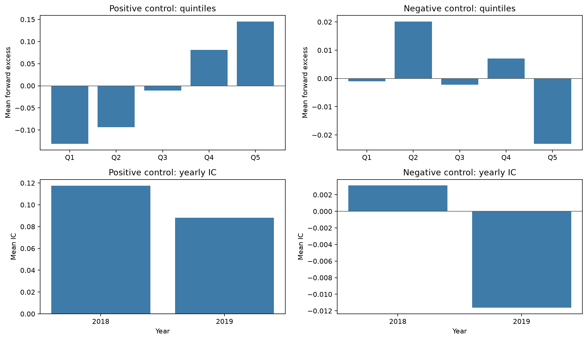
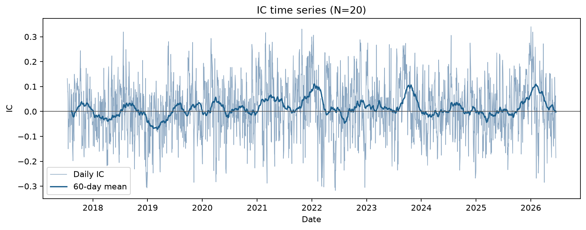
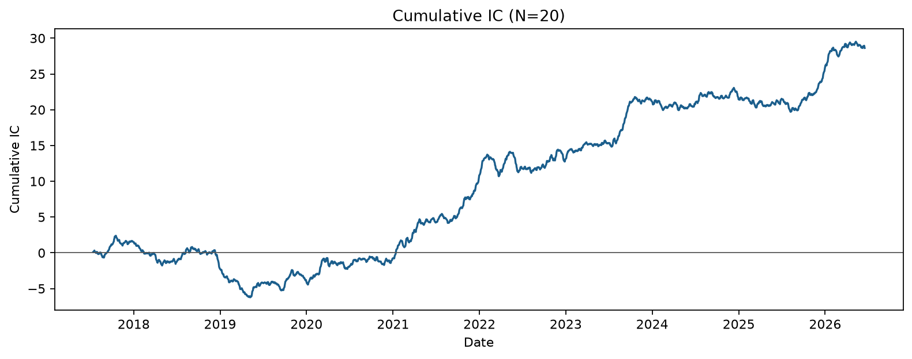
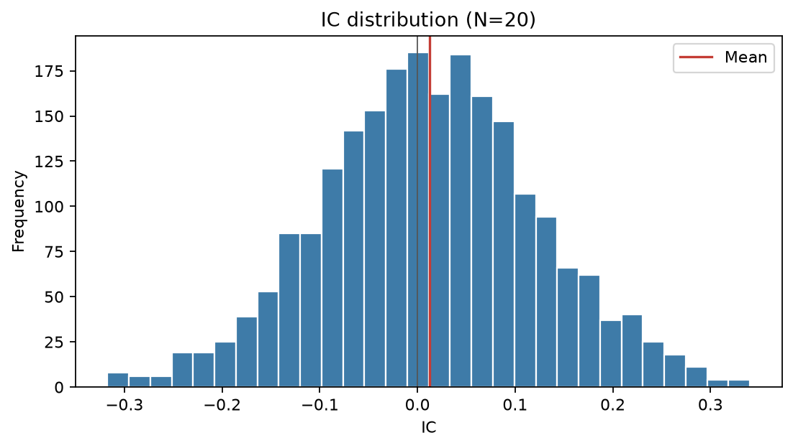
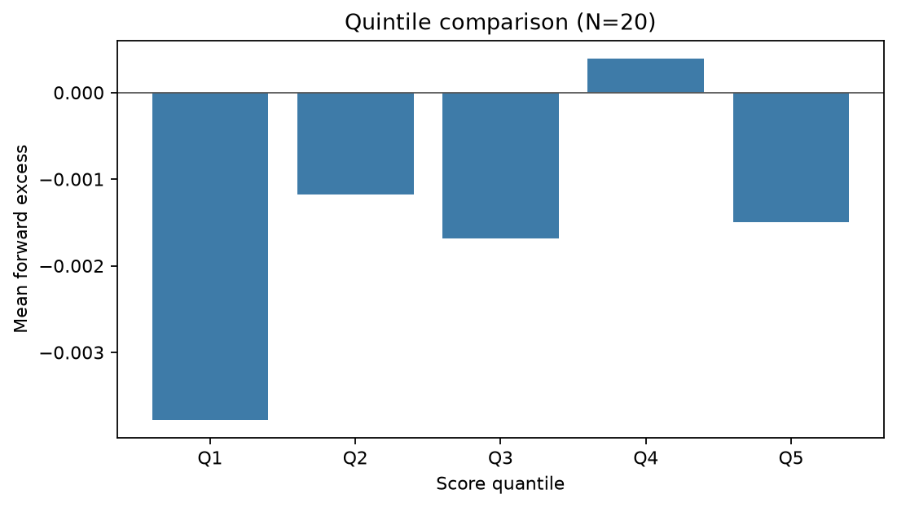
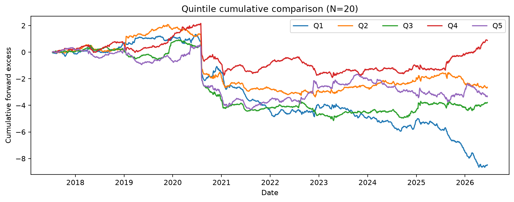
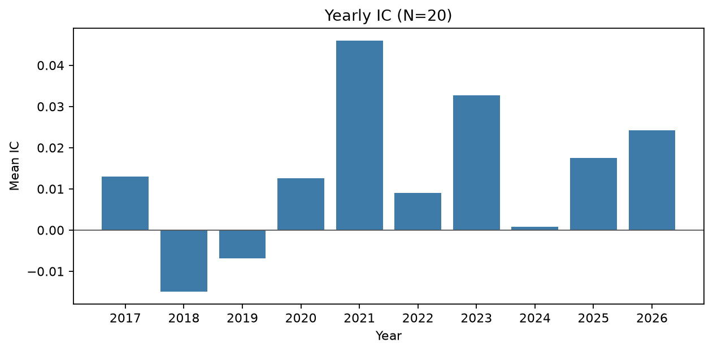
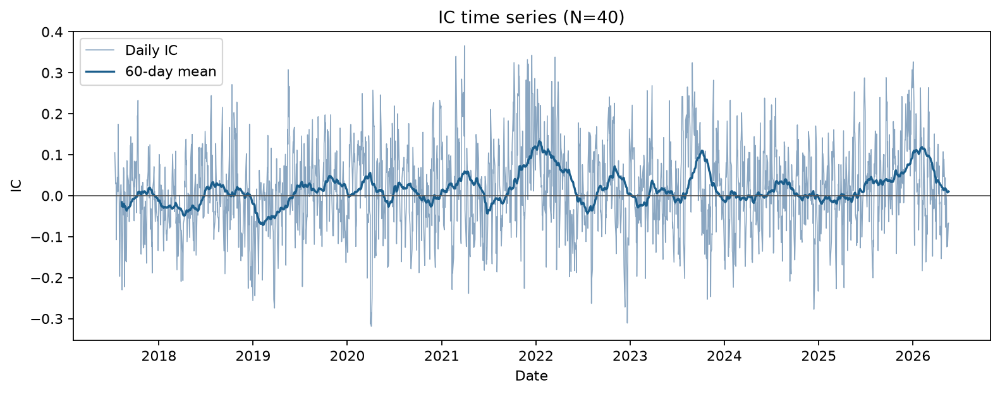
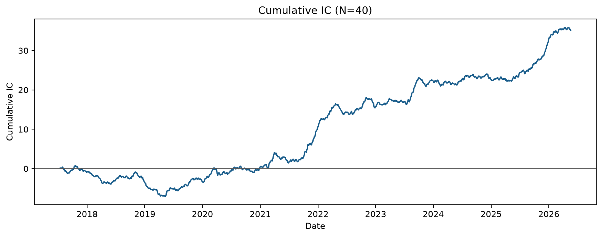
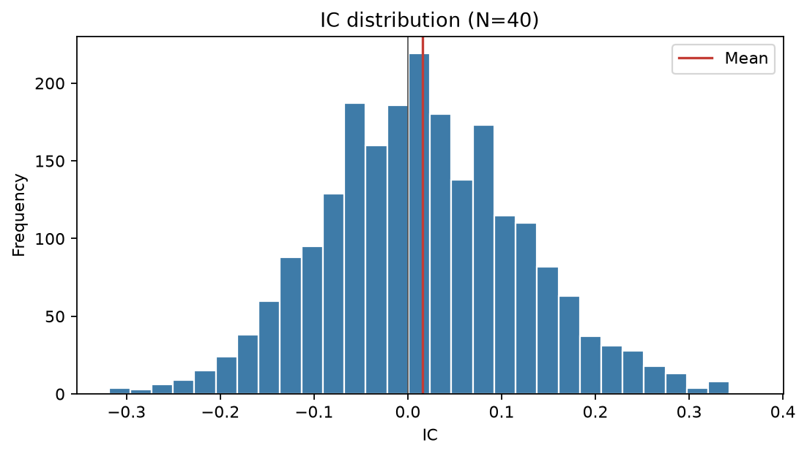
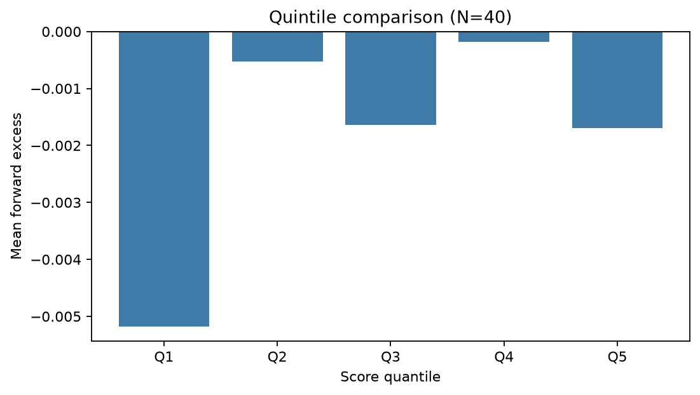
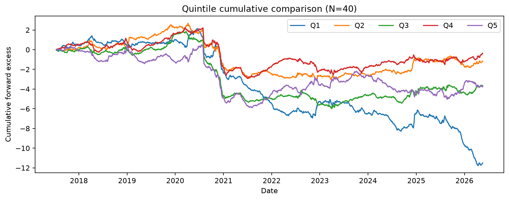
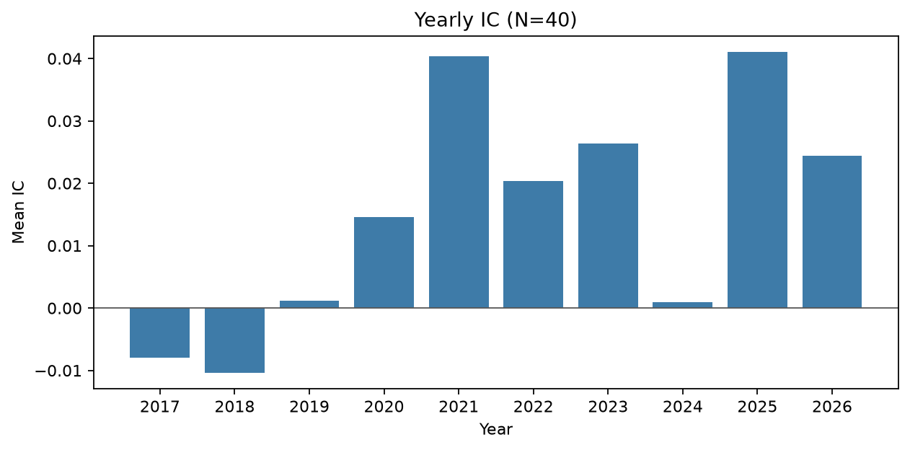
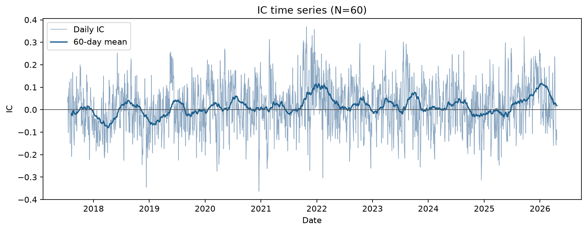
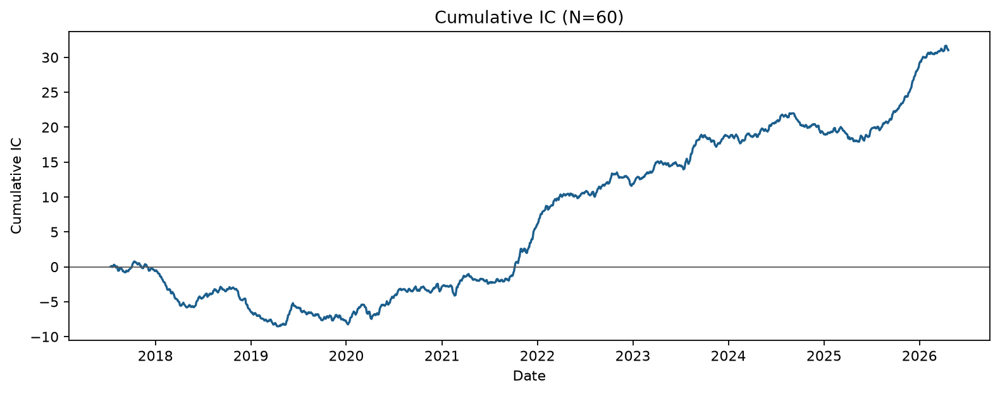
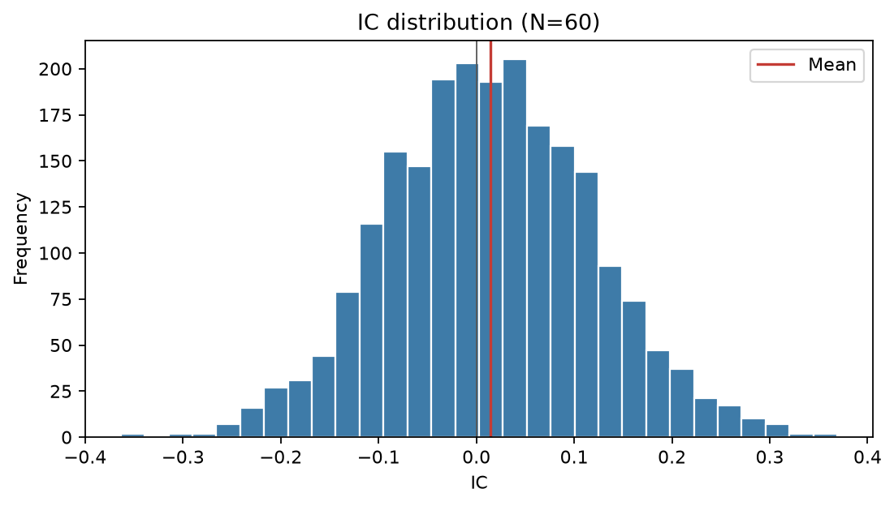
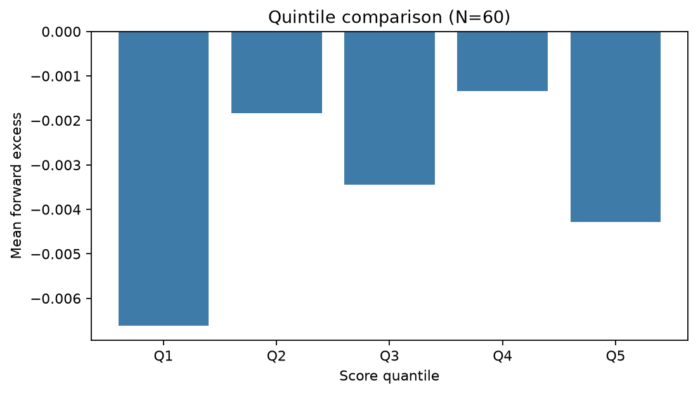
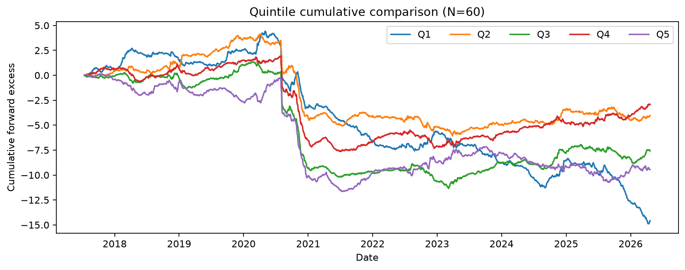
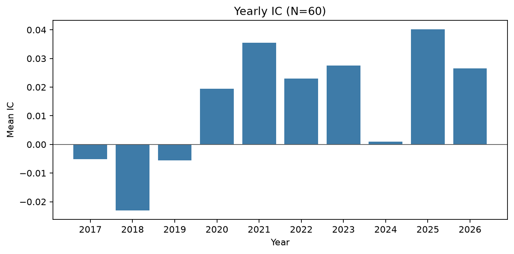
