# 板块萌芽现象 · steady 分量单独检验

## 预注册判据结论

- v1.0 合成萌芽分已否决；本报告不重新加权、不调 steady 常数，只把既有 steady 单独送考。
- 板块定义：Nasdaq screener 细分行业（非 GICS）
- 偏差声明：沿用 v1.0：基于当前股票池与静态行业快照回填历史，存在幸存者偏差和行业归属漂移；结论偏乐观，真实表现只会更差。
- 合成对照闸门：全部通过（沿用同一 v1.0 真实研究入口）。
- 分位单调且 Q5>0（N=[20, 60]）：未通过
- Top−Bottom 均值>0 且 HAC |t|>2（全部 horizon）：未通过
- 逐年价差稳定（≥6/10 年为正，2017–2020 不得全负）：未通过
- 非重叠 IC 核对与 HAC 一致（全部 horizon）：通过
- 裁决：**否决：steady 未满足结构干净判据；板块萌芽方向关闭**
  - 正对照：通过；{'mean_ic': 0.10405543196143864, 'top_bottom': 0.276297756778555, 'hac_t': 8.979171605108203}
  - 负对照：通过；{'mean_ic': -0.00010134872080088974, 'false_positive_rate': 0.05, 'repetitions': 200}
  - 置换检验：通过；{'mean_ic': -0.0009603262884686677, 'p_value': 0.9123775236188336}
  - 手算单测：通过；{'first_day_ic': 1.0, 'hac_t': 4.242640687119285}

## Horizon 20

- 五档严格向上：未通过；Q5>0：通过。
- Top−Bottom：通过；均值 0.007009，HAC t 2.850，p 0.004375。
- 逐年价差为正：6 年；2017–2020 全负：未通过。
- steady IC：均值 0.032844，HAC t 4.153；非重叠核对：通过。

| 年份 | steady IC 均值 | Top−Bottom 平均超额 | IC 观测 |
| --- | ---: | ---: | ---: |
| 2017 | 0.005940 | 0.002171 | 118 |
| 2018 | -0.018923 | -0.001001 | 251 |
| 2019 | 0.010156 | -0.003608 | 252 |
| 2020 | 0.048664 | 0.014486 | 253 |
| 2021 | 0.072057 | 0.016504 | 252 |
| 2022 | 0.021761 | -0.000451 | 251 |
| 2023 | 0.055017 | 0.005432 | 250 |
| 2024 | 0.020475 | -0.001845 | 252 |
| 2025 | 0.048253 | 0.020357 | 250 |
| 2026 | 0.072015 | 0.025567 | 115 |

## Horizon 40

- 五档严格向上：未通过；Q5>0：通过。
- Top−Bottom：通过；均值 0.010090，HAC t 2.217，p 0.026620。
- 逐年价差为正：7 年；2017–2020 全负：未通过。
- steady IC：均值 0.038004，HAC t 3.835；非重叠核对：通过。

| 年份 | steady IC 均值 | Top−Bottom 平均超额 | IC 观测 |
| --- | ---: | ---: | ---: |
| 2017 | -0.017729 | -0.006436 | 118 |
| 2018 | -0.012157 | -0.002363 | 251 |
| 2019 | 0.031316 | 0.001018 | 252 |
| 2020 | 0.046821 | 0.013955 | 253 |
| 2021 | 0.050720 | 0.017030 | 252 |
| 2022 | 0.030152 | 0.000131 | 251 |
| 2023 | 0.034365 | 0.003037 | 250 |
| 2024 | 0.027247 | -0.000503 | 252 |
| 2025 | 0.100584 | 0.039855 | 250 |
| 2026 | 0.094461 | 0.053532 | 95 |

## Horizon 60

- 五档严格向上：未通过；Q5>0：通过。
- Top−Bottom：未通过；均值 0.008408，HAC t 1.292，p 0.196441。
- 逐年价差为正：5 年；2017–2020 全负：未通过。
- steady IC：均值 0.038774，HAC t 4.030；非重叠核对：通过。

| 年份 | steady IC 均值 | Top−Bottom 平均超额 | IC 观测 |
| --- | ---: | ---: | ---: |
| 2017 | -0.014613 | -0.007150 | 118 |
| 2018 | -0.022724 | -0.020759 | 251 |
| 2019 | 0.019321 | -0.000474 | 252 |
| 2020 | 0.066135 | 0.011450 | 253 |
| 2021 | 0.050557 | 0.015326 | 252 |
| 2022 | 0.045605 | -0.004545 | 251 |
| 2023 | 0.045704 | 0.019456 | 250 |
| 2024 | 0.031884 | -0.003165 | 252 |
| 2025 | 0.085842 | 0.038179 | 250 |
| 2026 | 0.082361 | 0.072992 | 75 |

## 图表

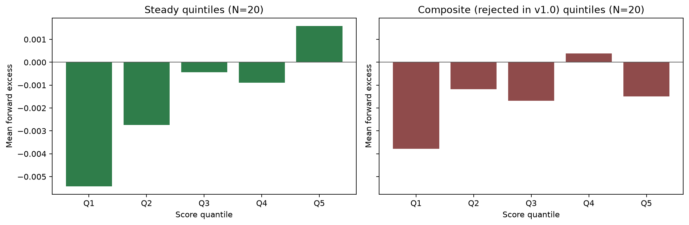
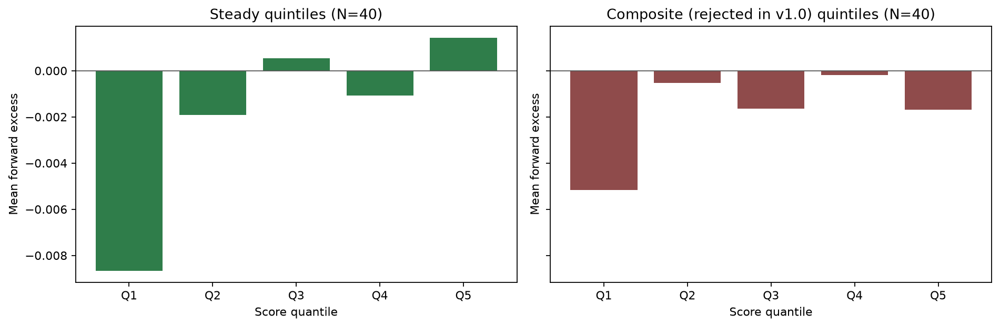
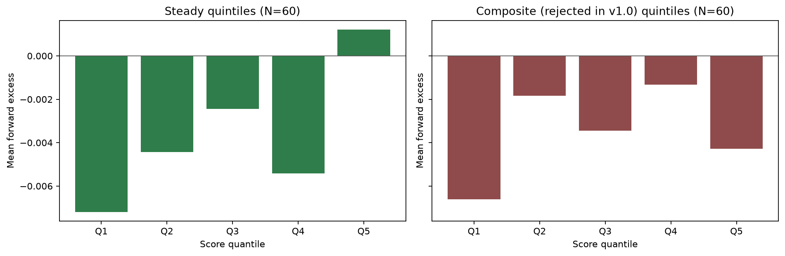
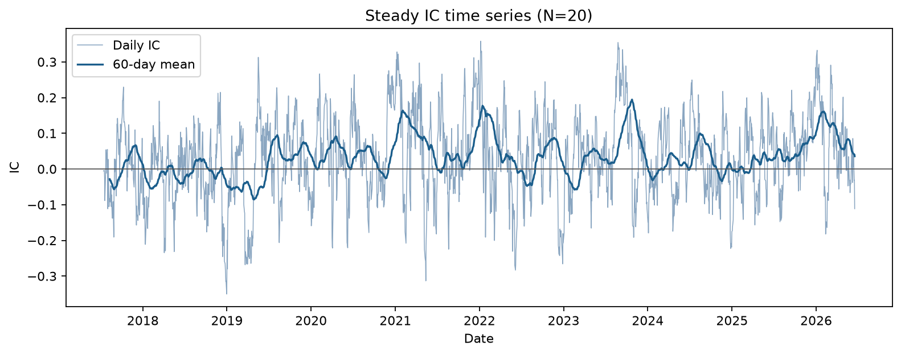
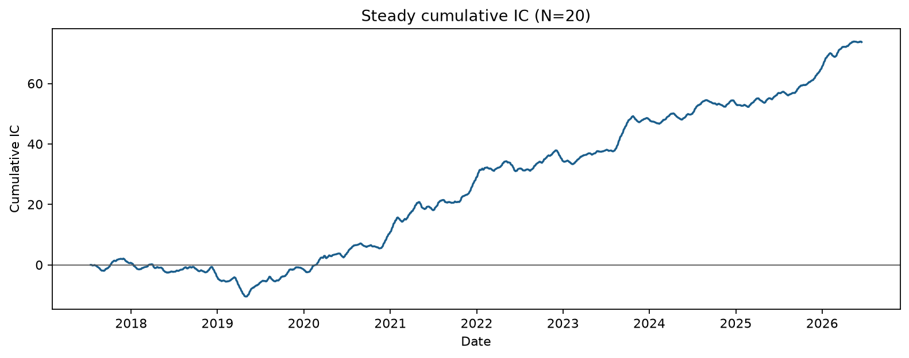
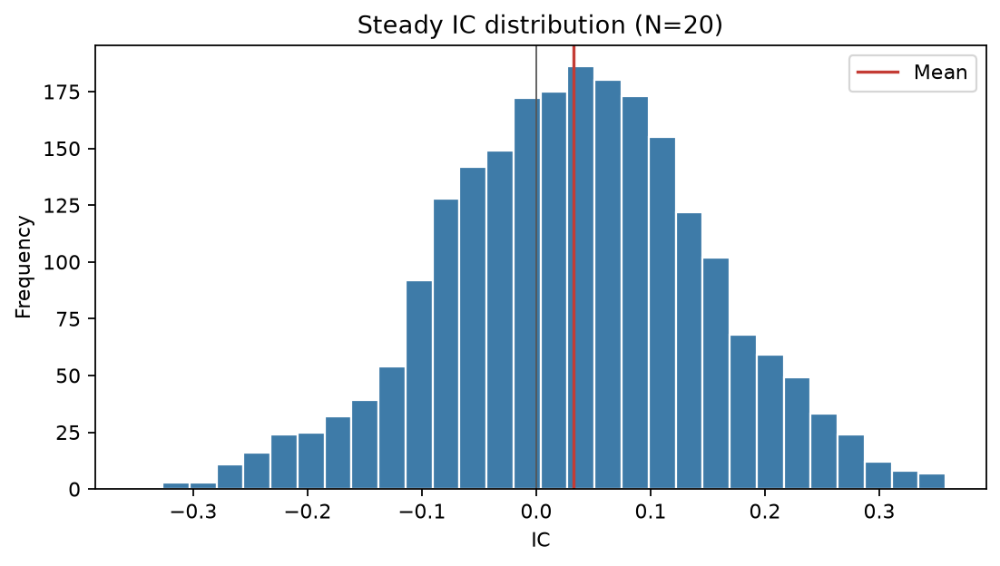
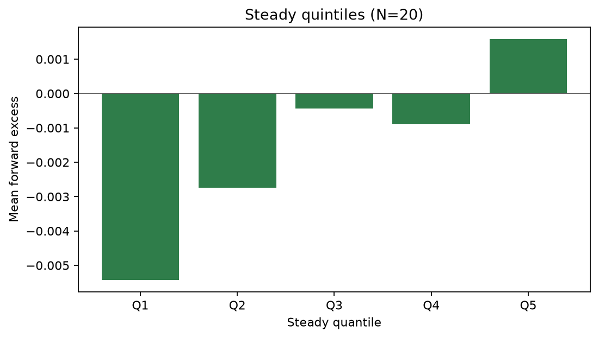
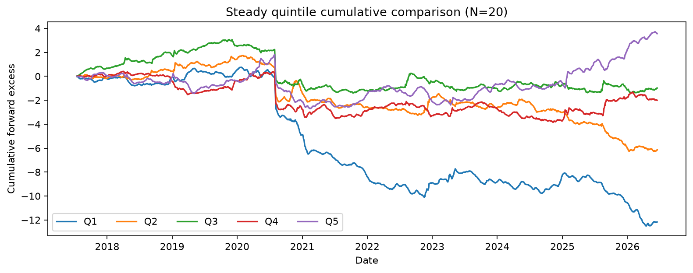
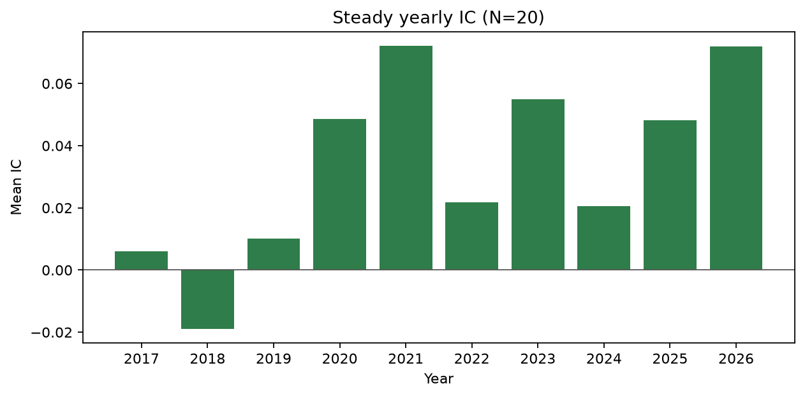
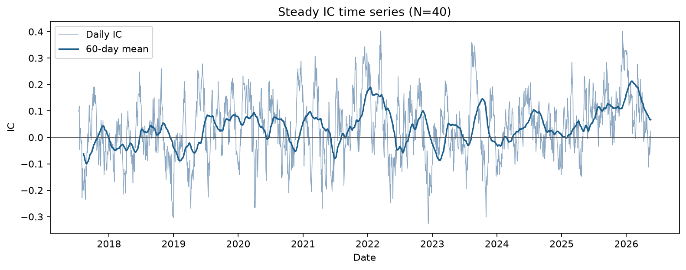
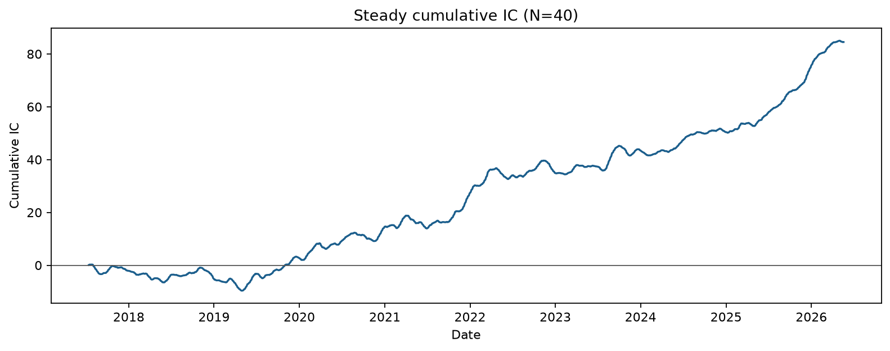
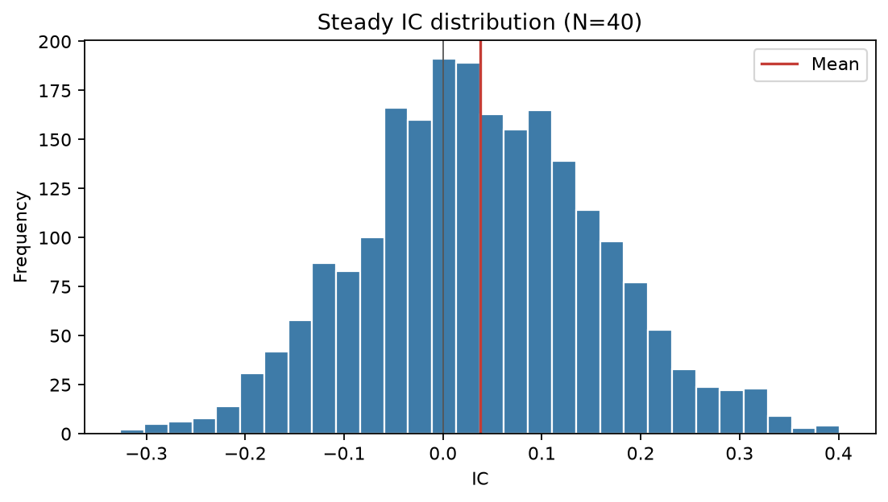
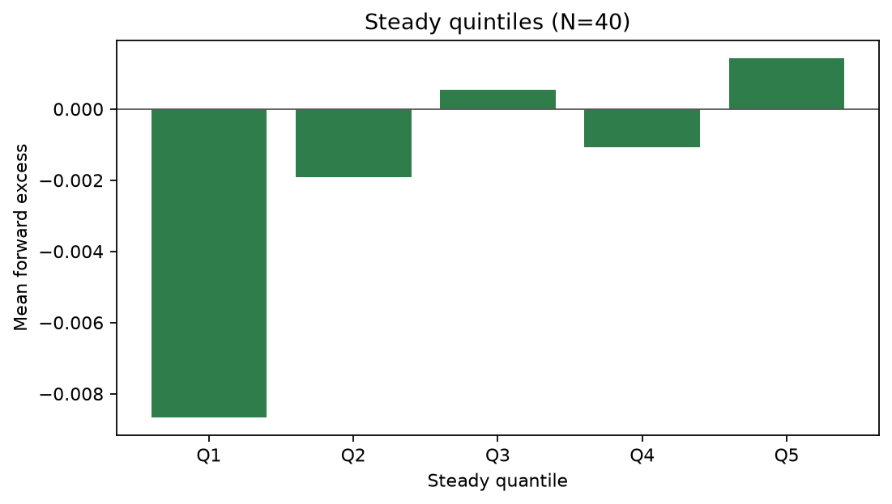
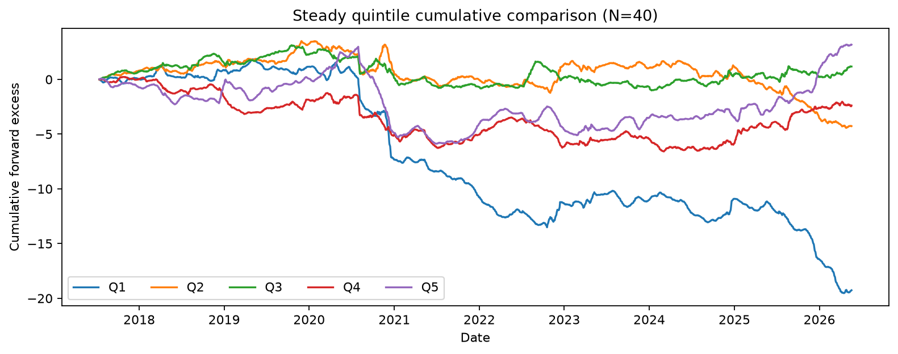
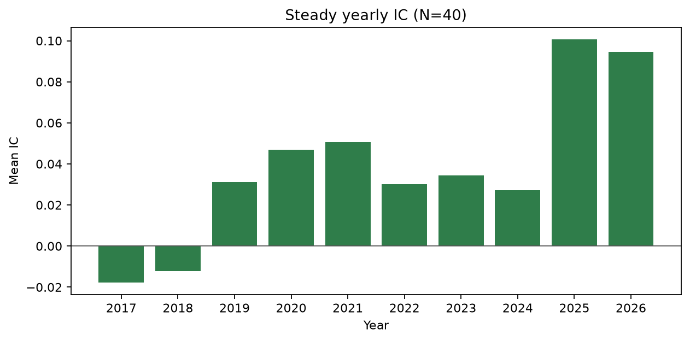
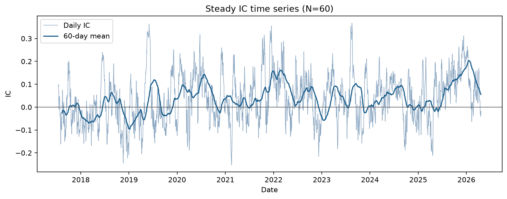
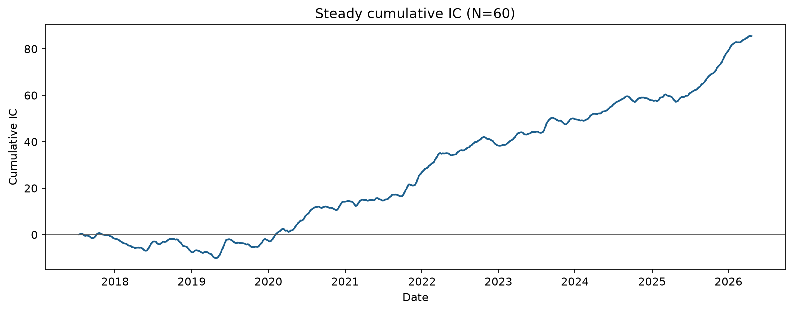
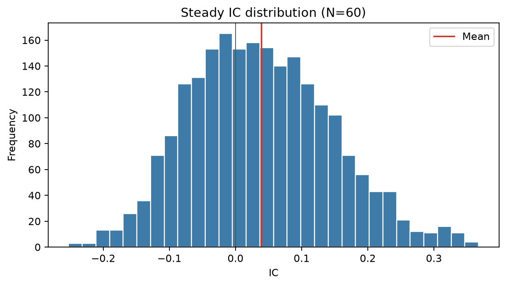
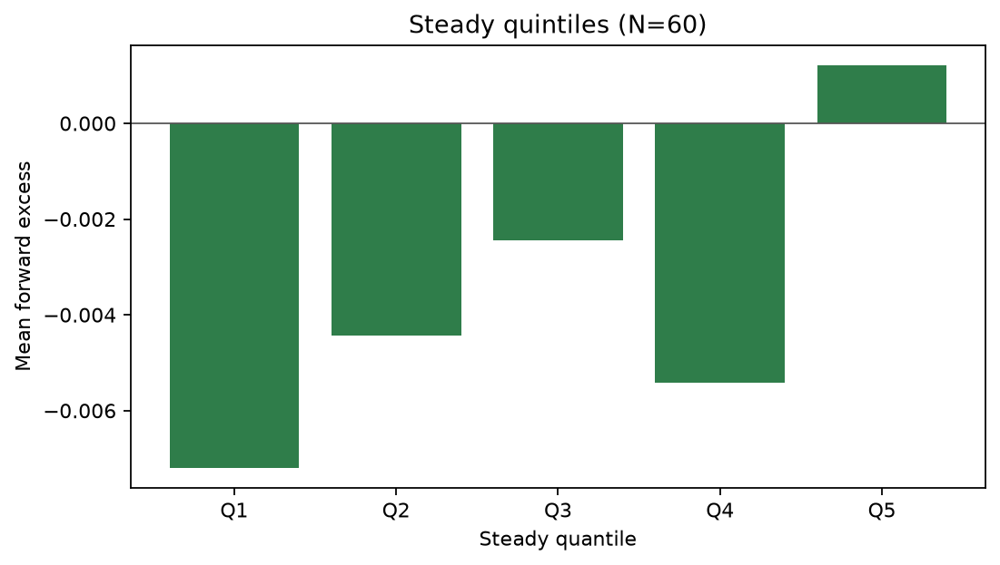
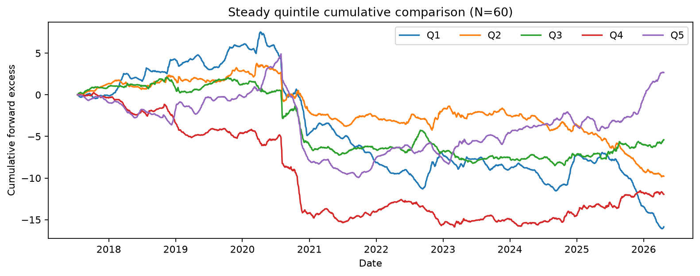
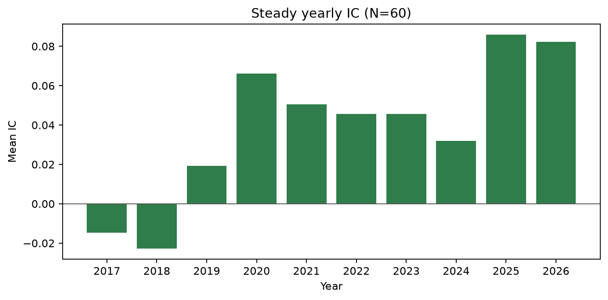
